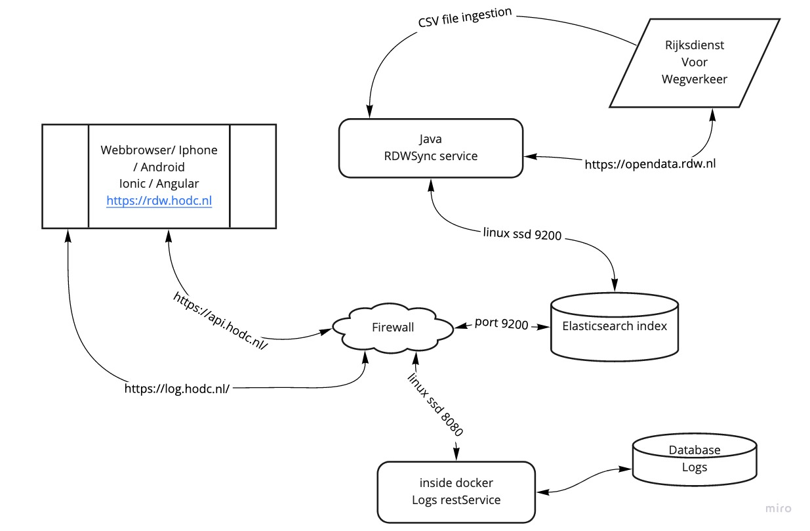

# Sync app
## Dit is een Java spring applicatie ten behoeve van het syncen van een elasticsearch index.
###### De applicatie heeft een drietal manieren van indexeren

* Inlezen CSV;
* Op basis van Kenteken reeksen gegevens ophalen bij de RDW en in de index plaatsen;
* Het laatst uitgegeven kenteken ophalen en deze en omliggende range in de index plaatsen;

Functionaliteit | Omschrijving
------------ | -------------
CSV | Zet in application.properties app.csv=Y 
Reeksen | app.csv=N en zet de startreeks app.startplate=DBBBAA

## Onder vind je de wijze van het aanmaken van de ES indexen.

DELETE rdw

PUT rdw

PUT rdw/_mapping 
{
"properties": {
        "Kenteken": { "type": "text" },
        "Merk": { "type": "text" },
        "Handelsbenaming": { "type": "text" },
        "EersteKleur": { "type": "text" },
        "TweedeKleur": { "type": "text" },
        "DatumEersteToelating": { "type": "text" },
        "Voertuigsoort": { "type": "text" },
        "Inrichting": { "type": "text" },
        "message": { "type": "text" }
      }
}

DELETE zoektermen

PUT zoektermen

PUT zoektermen/_mapping 
{
"properties": {
        "zoekterm": { "type": "text" },
        "herkomst": { "type": "text" }
      }
}

PUT /zoektermen/_doc/bmw
{
  "zoekterm": "bmw",
  "herkomst": "handmatig"
}

PUT /zoektermen/_doc/groen
{
  "zoekterm": "groen",
  "herkomst": "handmatig"
}

GET zoektermen/_search
{
    "query": {
        "match_all": {}
    }
}

GET rdw/_search
{
    "query": {
        "match_all": {}
    }
}

